# 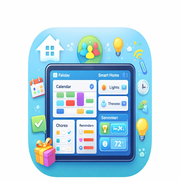 Family Panel

A self-hosted family dashboard built on top of [Home Assistant](https://www.home-assistant.io/). Designed for a wall-mounted tablet, it brings together a shared calendar, chore tracking, shopping list, presence detection, smart home controls, sensors, a photo frame, and push notifications - all in a single always-on screen with a full admin UI.

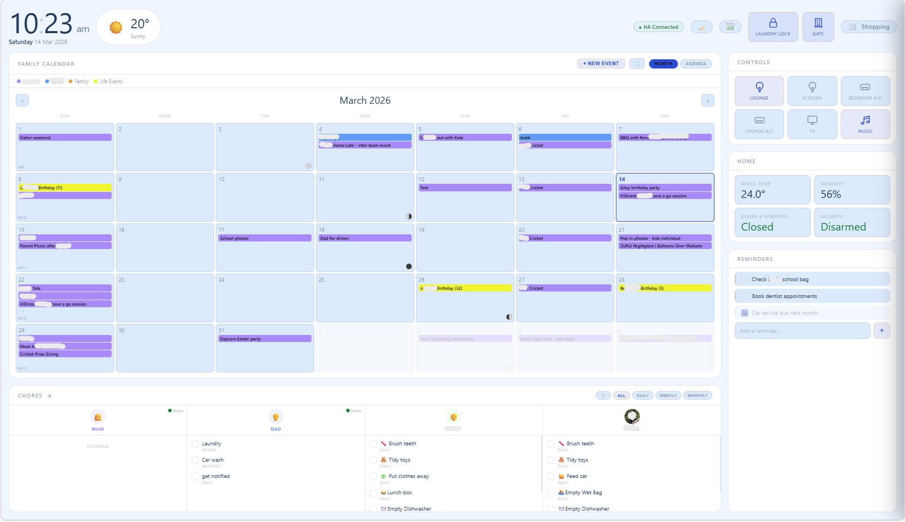

---

## Features

### 📅 Calendar
- Read/Write events from HA Calendars, speciically **Microsoft 365** via the [MS365-Calendar HACS integration](https://github.com/RogerSelwyn/MS365-Calendar)
- **Month view** with full-height event cells and multi-day event spanning
- **Agenda / combined view** showing upcoming events alongside the month grid
- **Day view** with hourly time slots and all-day event banners
- Create, edit, and delete calendar events directly from the dashboard
- Per-calendar colour coding
- **Calendar deduplication** - prevents shared events showing twice across family members' calendars
- **Week number display** (configurable)
- **Configurable week start day** (Any day of the week)
- **Moon phase** indicator in the calendar header (configurable)

### ✅ Chores
- Per-person chore cards on the dashboard with tick-to-complete
- **Recurrence types:** Daily, Weekly, Monthly, Yearly, and Once
  - **Daily:** configure multiple reset times per day (e.g. 07:00 and 20:00)
  - **Weekly:** select which days of the week, plus an optional "show from" time so the chore only appears after a certain hour
  - **Monthly:** select which weeks of the month and which months
  - **Yearly:** select which months
- **Server-side auto-reset** - a scheduler runs every 60 seconds and resets chores based on their schedule
- **Chore log** - every completion is recorded with a timestamp; configurable retention (default 10 days)
- **Log viewer** - view the full chore history from the dashboard with filters by person and search by chore name
- **Clone / duplicate** a chore
- **Push notifications:**
  - Notify when a chore is **completed**
  - Notify when a chore **becomes active** / resets into the list
- Fullscreen overlay view of all chores with filter by recurrence type

### 🛒 Shopping List
- Backed by a Home Assistant `todo.*` entity
- Add and check off items directly from the dashboard

### 👨‍👩‍👧 Family Members & Presence
- Add family members with name, colour, emoji, or uploaded photo
- **Live presence** - shows who is home based on HA `person.*` entities, with a coloured dot on each chore column
- Per-person **notification entity** (`notify.mobile_app_*`) for push notifications

### 💡 Controls
- Toggle lights, switches, climate, and any other HA entity from the dashboard
- Custom icons, labels, and on/off service configuration per button
- State reflected in real-time

### 🌡️ Sensors
- Display temperature, humidity, door/window, and any generic HA entity
- **Alarm panel** - tap the tile to arm or disarm; supports Arm Home, Arm Away, Arm Night, and Disarm; optional PIN code entry per panel

### 🌤️ Weather
- Pulls from a Home Assistant `weather.*` entity (primary)
- Falls back to **Open-Meteo** if no HA entity is configured
- 5-day forecast with icons and temperature range

### 🖼️ Photo Frame
- Pulls albums from **Immich** (self-hosted photo library)
- Pan-and-zoom effect between photos
- Activates automatically after a configurable idle period
- Tap zones to pause, skip, or exit
- Configurable photo change interval

### 🎨 Themes
- Light and dark mode with **10 preset themes** (Obsidian, Midnight Blue, Forest, Rose, Arctic, Amber, Ocean, Slate, Lavender, Crimson)
- Separate theme presets for light and dark modes

### 🔒 Admin Portal
- Full configuration UI at `/admin` - no JSON editing required
- Password-protected login (SHA-256 hashed, never stored in plaintext)
- IP allowlist for extra security

---

## Screenshots

| | |
|---|---|
|  | 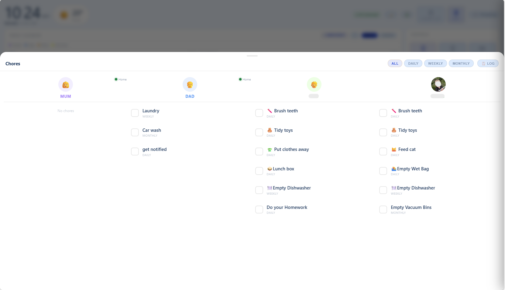 |
| Dashboard - main view | Chores fullscreen overlay |
| 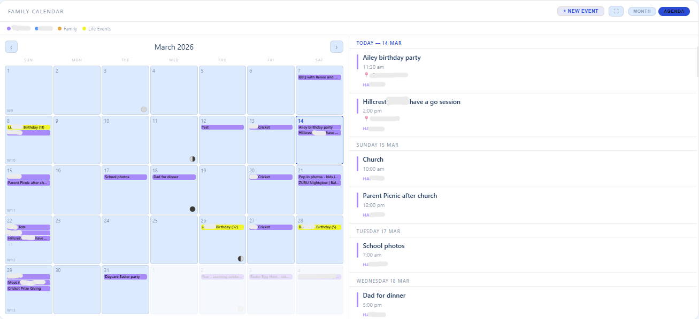 | 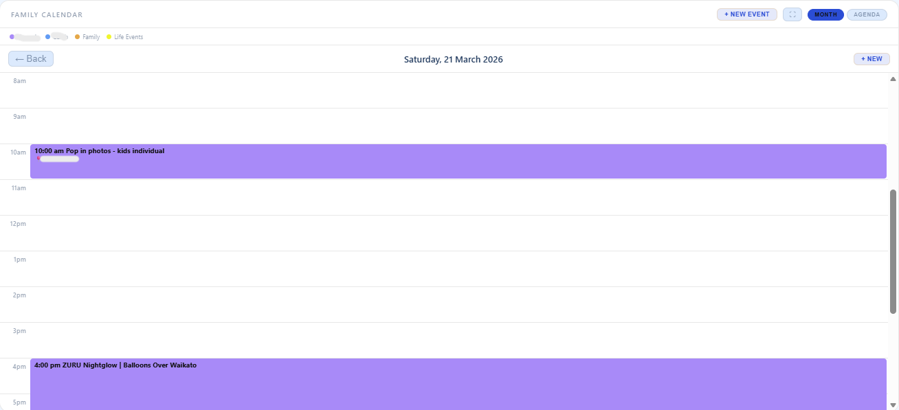 |
| Calendar - month view | Calendar - day view |
| 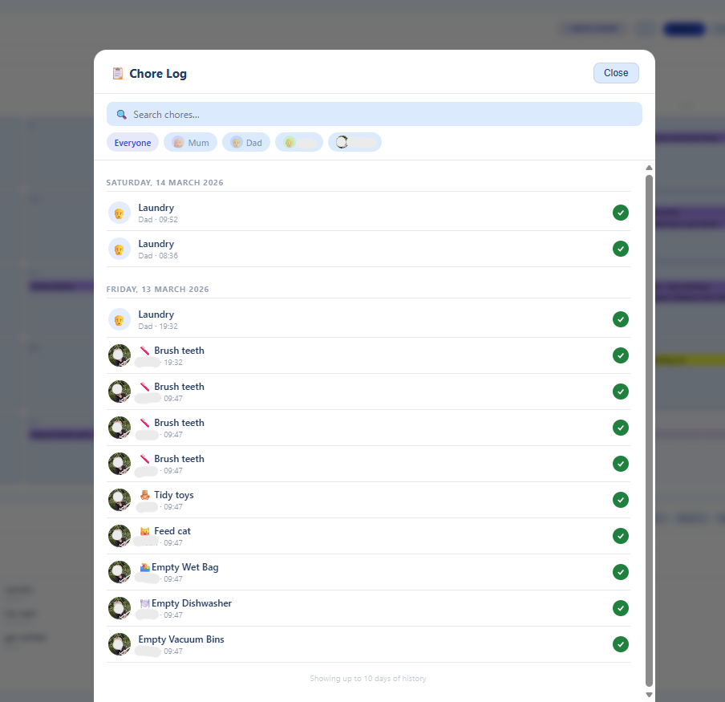 | 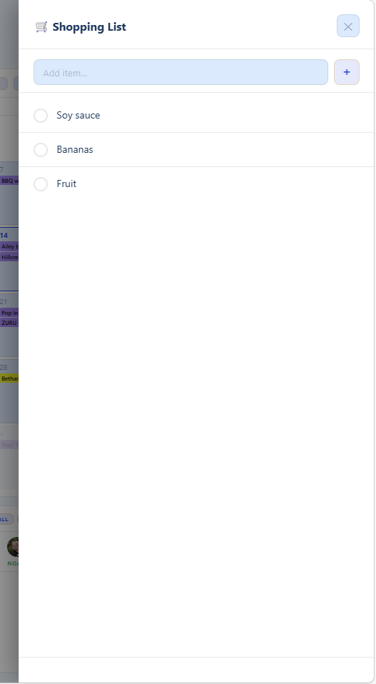 |
| Chore log with filters | Shopping list drawer |
| 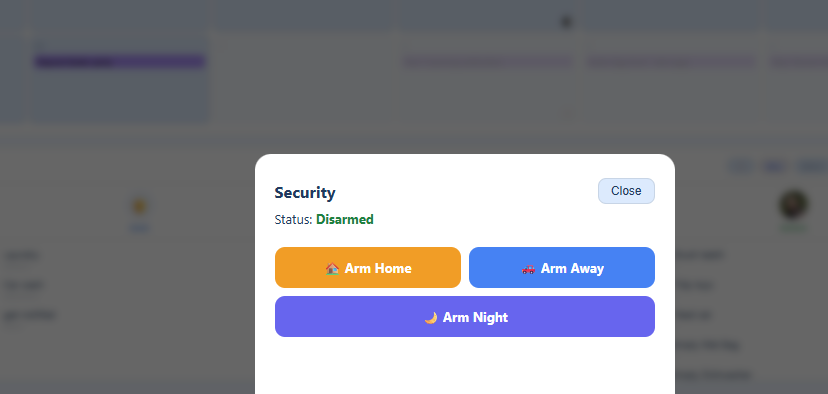 | 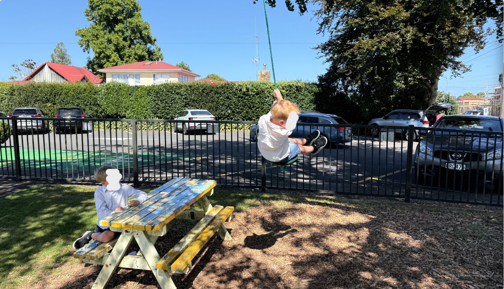 |
| Alarm panel controls | Photo frame (Immich) |
| 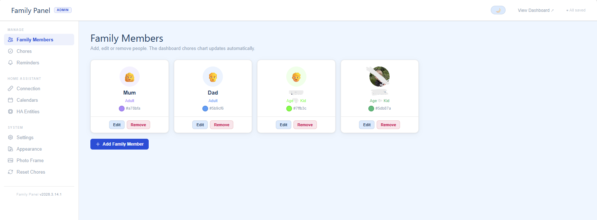 | 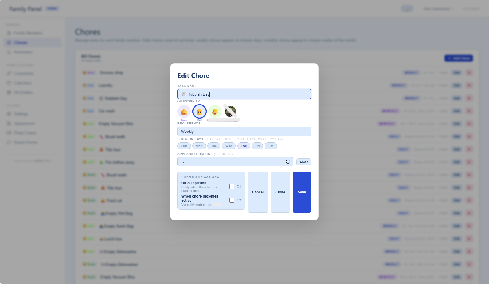 |
| Admin - Family Members | Admin - Chore edit modal |
| 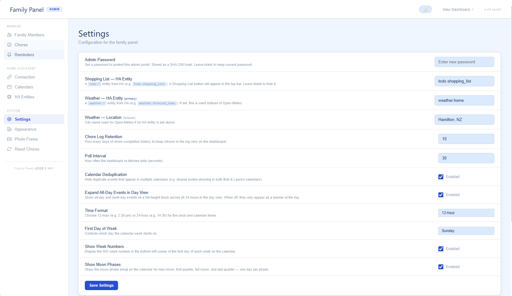 | 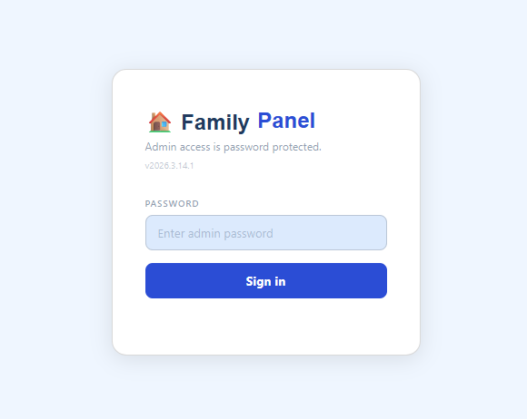 |
| Admin - Settings | Admin login page |

---

## Prerequisites

| Requirement | Notes |
|---|---|
| **Node.js 18+** | Zero npm dependencies - uses only built-in Node modules |
| **Home Assistant** | Any recent version (2023+) |
| **MS365-Calendar** (HACS) | For Microsoft 365 / Outlook calendar sync |
| A browser on the same network | Designed for a wall-mounted tablet |

### MS365-Calendar HACS Integration

1. Install [HACS](https://hacs.xyz/) if you haven't already.
2. In HACS → Integrations, search for **MS365 Calendar** by RogerSelwyn and install it.
3. Follow the integration setup to authorise your Microsoft account.
4. Your calendars will appear in HA as `calendar.m365calendar_yourname_calendar`.

---

## Setup

### 1. Clone the repo

```bash
git clone https://github.com/calebgab/home-assistant-family-panel.git
cd home-assistant-family-panel
```

Or download the zip directly from the [releases page](https://github.com/calebgab/home-assistant-family-panel/releases) and extract it.

### 2. Configure your HA connection

Edit `config.json`:

```json
{
  "ha_url": "http://homeassistant.local:8123",
  "ha_token": "YOUR_LONG_LIVED_ACCESS_TOKEN",
  "port": 8080
}
```

**Getting a long-lived access token:**
1. In Home Assistant, go to your **Profile** (bottom-left avatar).
2. Scroll to **Long-Lived Access Tokens** → **Create Token**.
3. Give it a name (e.g. "Family Panel") and copy the token.

> ⚠️ `config.json` contains your HA token - keep it private and never commit it to git.

Environment variables `FP_HA_URL`, `FP_HA_TOKEN`, and `FP_PORT` override `config.json` if set. Useful for Docker.

### 3. Start the server

```bash
node server.js
```

Open **http://localhost:8080** for the dashboard and **http://localhost:8080/admin** for the admin portal.

### 4. Configure from the Admin UI

Everything is configured from the admin portal - no need to edit `data.json` by hand.

---

## Running permanently

### PM2 (recommended for Raspberry Pi / Linux)

```bash
npm install -g pm2
pm2 start server.js --name family-panel
pm2 save
pm2 startup
```

### Docker (environment variables)

```bash
FP_HA_URL=http://homeassistant.local:8123 \
FP_HA_TOKEN=your_token_here \
FP_PORT=8080 \
node server.js
```

---

## Admin Portal Reference

Visit **http://your-server:8080/admin** to configure everything.

### Family Members

| Field | Description |
|---|---|
| Name | Display name |
| Colour | Used for chore column headers and presence dots |
| Emoji / Photo | Avatar shown on chores and in the chore log |
| Age | Flags child vs adult |
| HA Person Entity | `person.*` entity for live presence (e.g. `person.laura`) |
| Notification Entity | `notify.mobile_app_*` for push notifications |

### Chores

| Field | Description |
|---|---|
| Label | Chore name - emoji supported (e.g. `🦷 Brush teeth`) |
| Assigned to | Avatar picker |
| Recurrence | Daily / Weekly / Monthly / Yearly / Once |
| Reset times | Daily - one or more HH:MM times to reset |
| Days | Weekly - which days of the week |
| Show from time | Weekly - hide the chore until this time |
| Weeks of month | Monthly - which weeks (1st–4th) |
| Months | Monthly / Yearly - which months to be active |
| Notify on completion | Push when ticked done on the dashboard |
| Notify when active | Push when chore resets and appears in the list |

### HA Entities

**Sensors** support these types:

| Type | Behaviour |
|---|---|
| Temperature | Shows °C, warns above 26° |
| Humidity | Shows %, warns above 70% |
| Door / Window | Open (red) / Closed (green) |
| Alarm Panel | Tappable - opens arm/disarm sheet; optional PIN |
| Generic | Shows raw HA state |

### Settings

| Setting | Default |
|---|---|
| Admin Password | - |
| Shopping List Entity (`todo.*`) | - |
| Weather Entity (`weather.*`) | - |
| Weather Location (fallback) | - |
| Poll Interval (seconds) | 30 |
| Chore Log Retention (days) | 10 |
| Calendar Deduplication | On |
| Expand All-Day Events in Day View | On |
| Time Format | 24-hour |
| Week Start | Monday |
| Week Numbers | Off |
| Moon Phase | Off |

### Photo Frame

| Setting | Default |
|---|---|
| Immich URL | - |
| Immich API Key | - |
| Album | - |
| Idle timeout (minutes) | 5 |
| Photo interval (seconds) | 20 |
| Tap zones | On |

---

## Push Notifications Setup

1. Install the **Home Assistant Companion App** on each phone.
2. HA registers a `notify.mobile_app_*` service automatically.
3. In **Admin → Family Members**, edit each person and enter their notify entity.
4. When editing a chore, the **Push Notifications** section appears if the assigned person has a notify entity configured. Two options:
   - **On completion** - fires when ticked done on the dashboard
   - **When active** - fires from the server when the chore resets

---

## Alarm Panel Setup

1. In **Admin → HA Entities → Sensors**, add a sensor with type **Alarm panel**.
2. Enter the `alarm_control_panel.*` entity ID.
3. Tick **Require PIN** if your panel needs a code.
4. On the dashboard, tap the tile to open arm/disarm controls.

---

## Diagnostic Endpoints

| URL | Purpose |
|---|---|
| `/api/ha/test` | Full HA connectivity report |
| `/api/ha/ping` | Quick connection check |
| `/api/version` | Current version from `package.json` |
| `/api/ha/services?domain=alarm_control_panel` | Inspect HA service schemas |

---

## Tech Stack

- **Backend:** Pure Node.js 18+ - zero npm dependencies
- **Frontend:** Vanilla HTML/CSS/JS - no framework, no build step
- **Fonts:** DM Sans + Nunito (Google Fonts)
- **Calendar:** Home Assistant REST API + MS365-Calendar HACS integration
- **Weather:** HA `weather.*` entity or Open-Meteo API
- **Photos:** Immich REST API

---

## Acknowledgements

- [RogerSelwyn/MS365-Calendar](https://github.com/RogerSelwyn/MS365-Calendar)
- [Home Assistant](https://www.home-assistant.io/)
- [Immich](https://immich.app/)
- [Open-Meteo](https://open-meteo.com/)

---

## License

GNU AGPL v3 - see [LICENSE](LICENSE) for details.
